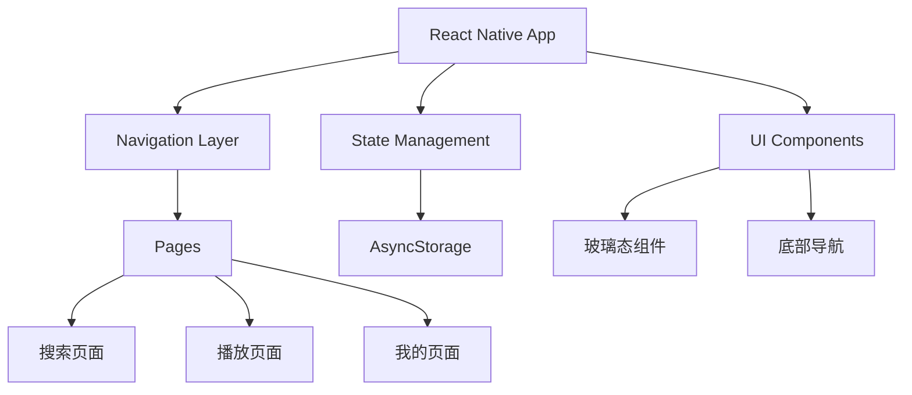

## 1. Architecture Design



## 2. Technology Description
- 前端框架：React Native @latest + TypeScript
- 导航：React Navigation
- 状态管理：React Context API + useState
- 本地存储：AsyncStorage
- UI库：React Native Reanimated（动画）、React Native Blur（玻璃态效果）
- 图标：@react-native-vector-icons/ionicons（阿里巴巴图标库兼容）
- 构建工具：Expo（快速开发和构建）

## 3. Route Definitions
| Route | Purpose |
|-------|---------|
| Search | 搜索页面 |
| Player | 播放页面 |
| Profile | 我的页面 |

## 4. Data Model
### 4.1 数据结构
```typescript
interface Song {
  id: string;
  title: string;
  artist: string;
  coverUrl: string;
  duration: number;
}

interface SearchHistory {
  id: string;
  term: string;
  timestamp: number;
}

interface UserProfile {
  id: string;
  username: string;
  avatarUrl: string;
  likedSongs: Song[];
  playlists: Playlist[];
}

interface Playlist {
  id: string;
  name: string;
  songs: Song[];
}
```

### 4.2 本地存储
- 使用AsyncStorage存储搜索历史（最多20条）
- 使用AsyncStorage存储用户点赞列表和歌单
