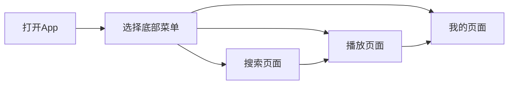

## 1. Product Overview
音乐播放App，支持音乐搜索、播放、收藏和歌单管理。
- 主要功能：音乐搜索、播放控制、个人收藏和歌单管理
- 目标用户：喜欢在手机上听音乐的用户群体

## 2. Core Features

### 2.2 Feature Module
1. **搜索页面**：搜索框、搜索历史标签
2. **播放页面**：音乐封面、歌名、点赞、下载、进度条、上下滑动切换歌曲
3. **我的页面**：个人信息、点赞列表、歌单

### 2.3 Page Details
| Page Name | Module Name | Feature description |
|-----------|-------------|---------------------|
| 搜索页面 | 搜索框 | 输入关键词搜索音乐 |
| 搜索页面 | 搜索历史标签 | 显示最近20个搜索记录，长按删除 |
| 播放页面 | 音乐信息 | 显示封面、歌名 |
| 播放页面 | 播放控制 | 点赞、下载、进度条 |
| 播放页面 | 歌曲切换 | 上下滑动切换上下首歌曲 |
| 我的页面 | 个人信息 | 用户头像、用户名 |
| 我的页面 | 收藏列表 | 显示用户点赞的歌曲 |
| 我的页面 | 歌单管理 | 显示用户创建的歌单 |

## 3. Core Process
用户打开App → 浏览底部菜单选择页面 → 在搜索页面查找音乐 → 点击播放 → 在播放页面控制播放 → 在我的页面管理收藏和歌单

## 4. User Interface Design
### 4.1 Design Style
- 主色：白色，辅色：黑色
- 按钮风格：高圆角、玻璃态透明效果
- 字体：现代简洁的无衬线字体
- 布局风格：卡片式布局，底部悬浮菜单栏
- 图标：阿里巴巴矢量图标库
- 特殊效果：高玻璃液态效果、高透明度、高圆角

### 4.2 Page Design Overview
| Page Name | Module Name | UI Elements |
|-----------|-------------|-------------|
| 搜索页面 | 搜索框 | 玻璃态圆角搜索框，居中放置 |
| 搜索页面 | 搜索历史 | 圆角标签，横向排列，支持长按删除 |
| 播放页面 | 音乐封面 | 居中大圆角卡片，带阴影效果 |
| 播放页面 | 控制按钮 | 玻璃态透明按钮，高圆角 |
| 播放页面 | 进度条 | 简洁的线性进度条 |
| 我的页面 | 个人信息 | 玻璃态卡片，头像+用户名 |
| 我的页面 | 功能列表 | 玻璃态卡片列表，带图标 |
| 通用 | 底部菜单 | 底部悬浮玻璃态菜单栏，三个图标 |

### 4.3 Responsiveness
移动优先设计，适配安卓设备，优化触摸交互
